# COV19 KI Projekt
Cov19 KI Projekt
Auswertung des Covid19 Datensatzes, über verschiedene Bereiche hinweg.

Im Datensatz sind die folgenden Punkte enthalten:
+ [DIVI-Intensivregister](https://www.intensivregister.de/#/index)
+ [Corona Warn App](https://www.coronawarn.app/de/analysis/)
+ [Impfungen](https://impfdashboard.de/daten)
+ [Cov19 Fallzahlen](https://github.com/robert-koch-institut/SARS-CoV-2_Infektionen_in_Deutschland)

Aktuelle Releases können [hier](https://github.com/BackInBash/cov19-ki/releases) heruntergeladen werden.

## ER Diagramm
Folgende Tabellen und Spalten bietet die Datenbank

## Auswertungen

### Fälle der letzen 30 Tage aller Landkreise

### ICU Auslastung

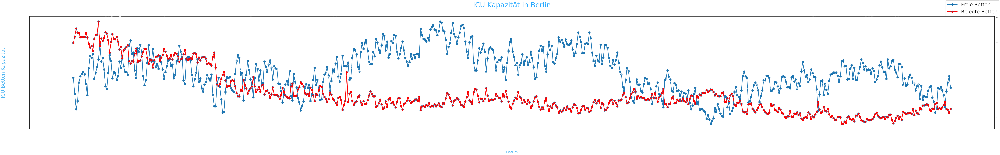
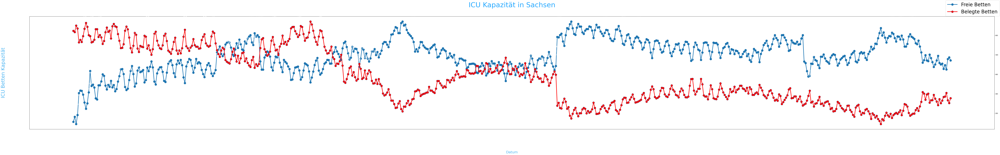
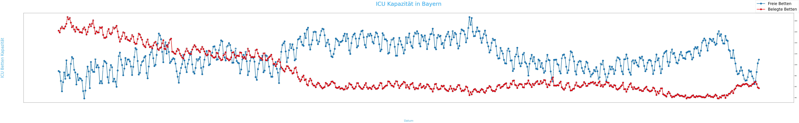
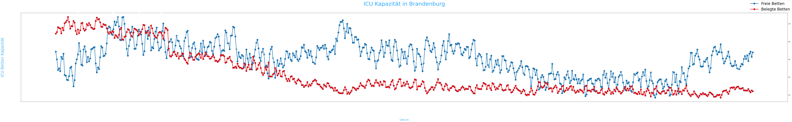
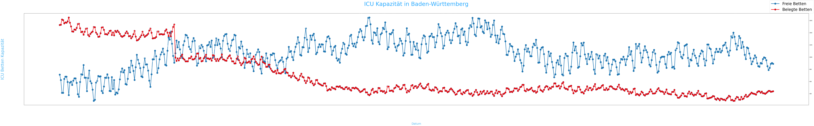
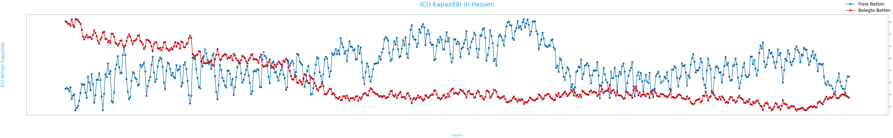
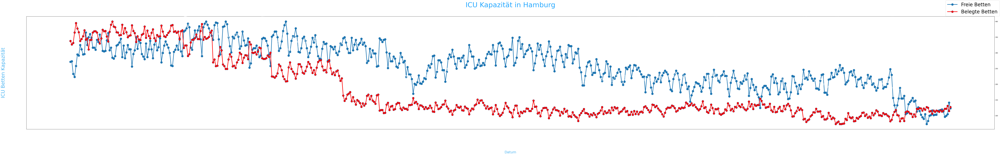
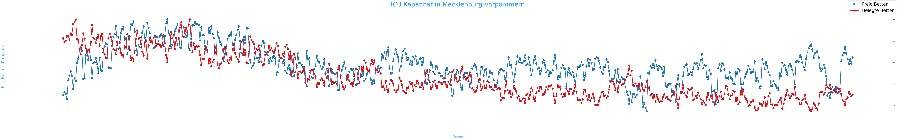
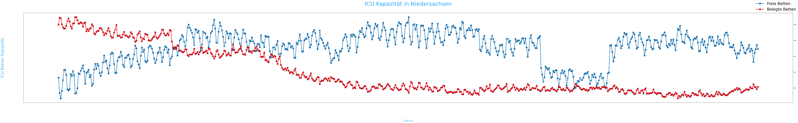
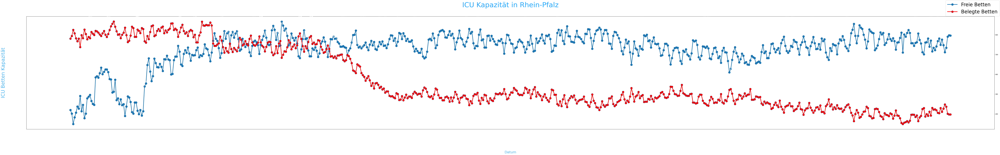

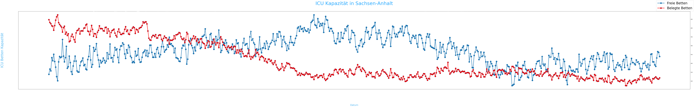
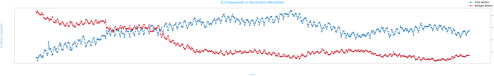
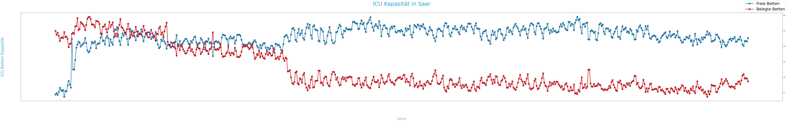